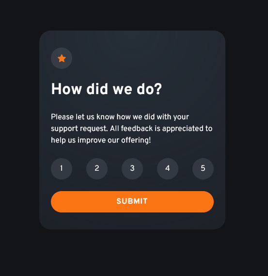

# Frontend Mentor - Interactive rating component solution

This is a solution to the [Interactive rating component challenge on Frontend Mentor](https://www.frontendmentor.io/challenges/interactive-rating-component-koxpeBUmI). Frontend Mentor challenges help you improve your coding skills by building realistic projects. 

## Table of contents

- [Overview](#overview)
  - [The challenge](#the-challenge)
  - [Screenshots](#screenshots)
  - [Links](#links)
- [My process](#my-process)
  - [Built with](#built-with)
  - [What I learned](#what-i-learned)
  - [Continued development](#continued-development)
- [Author](#author)

## Overview

### The challenge

Users should be able to:

- View the optimal layout for the app depending on their device's screen size
- See hover states for all interactive elements on the page
- Select and submit a number rating
- See the "Thank you" card state after submitting a rating

### Screenshots




### Links

- Solution URL: [Add solution URL here](https://github.com/FabianAlv/frontend-mentor-challenge-interactive-rating-component/tree/master)
- Live Site URL: [Add live site URL here](https://fabianalv.github.io/frontend-mentor-challenge-interactive-rating-component/)

## My process

I start by looking at the designs and imagine the possible HTML layout for everything to be styled in the easiest way (because making changes later when you already have a layout almost done making small changes could couse unexpected behaviors), after that I implement the HTML layout and start adding the styles from the biggest element to the smallest I also tooked the Mobile first approach.

### Built with

- Semantic HTML5 markup
- CSS custom properties
- Flexbox
- Mobile-first workflow

**Note: These are just examples. Delete this note and replace the list above with your own choices**

### What I learned

- I used gradiants to make the card look like the design
```css
.card {
      background-image: radial-gradient(circle at center top, hsla(213, 19%, 18%, 1) 0%, hsla(213, 19%, 18%, 0.5) 100%);
    }
```

### Continued development

- Improve my observation skills to notice minor details during the analysis of any design.
- Learn more about the different tools in CSS and HTML to create the same design in different ways.
- Set up the projects, so the have continuous integration

## Author

- Frontend Mentor - [@FabianAlv](https://www.frontendmentor.io/profile/FabianAlv)
